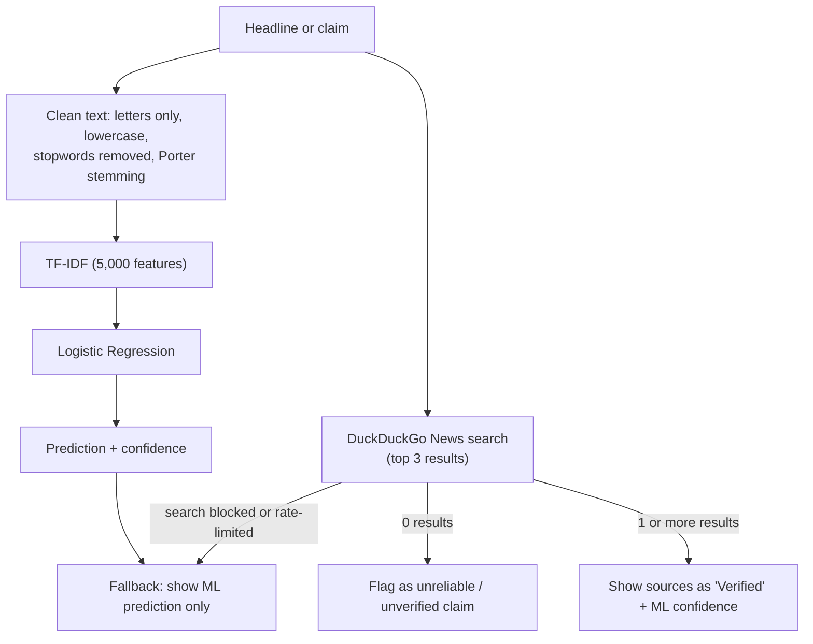

# 📰 Hybrid Fake News Detection System

**A fact-checking app that combines a machine-learning text classifier with live news search.** Paste a headline or claim: the model scores its linguistic patterns, and a DuckDuckGo News lookup checks whether real coverage exists.


**Jump to:** [How it works](#-how-it-works) · [Model performance](#-model-performance) · [Run it](#-run-it) · [Limitations](#-limitations)

---

## 🧠 How it works



1. **ML layer:** a Logistic Regression model on TF-IDF features scores the text.
2. **Verification layer:** the claim is searched on live news. If nothing is found, the app flags it as unreliable regardless of the ML score. If articles are found, they are listed with title, snippet, publisher and link.
3. **Fallback:** if search fails (rate limit or network restriction), the app says so and falls back to the model's prediction and confidence.

---

## 📊 Model performance

Measured on the held-out 20% test split (`random_state=42`); the positive class is `real` news.

| Metric | Score |
|---|---|
| Accuracy | ~82.74% |
| Precision | ~83.90% |
| Recall | ~95.50% |
| F1 | ~89.32% |

Recall is much higher than precision: the model rarely misses real news, but a noticeable share of items it calls "real" are actually fake. The live-search layer exists partly to compensate for this. The app shows these metrics in an expandable panel.

---

## 🚀 Run it

```bash
git clone https://github.com/Sajal-10903/Hybrid-Fake-News-Detection-System.git
cd Hybrid-Fake-News-Detection-System
python -m venv .venv
source .venv/bin/activate        # Windows: .venv\Scripts\activate
pip install -r requirements.txt
python -c "import nltk; nltk.download('stopwords')"
streamlit run fake_news_detector.py
```

The trained model and vectorizer (`model.pkl`, `vectorizer.pkl`) and test data are included, so **no retraining is needed** to run the app.

<details>
<summary><b>Retrain the model (optional)</b></summary>

Datasets are not included because of size. Download one and place it as `data/train.csv` (it must have a `title` column and a `real` label column):

- [Fake News Detection Datasets](https://www.kaggle.com/datasets/emineyetm/fake-news-detection-datasets?select=News+_dataset)
- [Fake News Classification](https://www.kaggle.com/datasets/saurabhshahane/fake-news-classification)

```bash
python train_model.py
```

This trains on headlines only (`title`), fits TF-IDF (5,000 features) and Logistic Regression on an 80/20 split, and writes the `.pkl` files the app loads.

</details>

---

## 📂 Project structure

```text
Hybrid-Fake-News-Detection-System/
├── fake_news_detector.py    # Streamlit app: prediction + live verification + metrics
├── train_model.py           # preprocessing, TF-IDF, Logistic Regression, saves .pkl files
├── model.pkl, vectorizer.pkl, *_test*.pkl
├── data/                    # place the training CSV here
└── requirements.txt
```

---

## ⚠️ Limitations

- **"Found articles" is not "claim is true".** The verification step only checks that the search returns news results. A false claim that shares keywords with real stories can still come back as "Verified". It does not compare what the articles actually say against the claim.
- The classifier is trained on **headlines only**, so long-form text will be out of distribution.
- Logistic Regression on TF-IDF learns dataset-specific wording patterns; accuracy on other sources or topics is not measured here.
- Live search depends on the DuckDuckGo API, which can be rate-limited or blocked.

**Next step that would make the biggest difference:** compare the retrieved articles' content with the claim (for example with semantic similarity or an entailment model) instead of counting results.

---

**Author:** [Sajal Raj](https://github.com/Sajal-10903) · [Portfolio](https://sajalraj-portfolio.vercel.app) · [LinkedIn](https://www.linkedin.com/in/sajal-raj-456b31252/)
